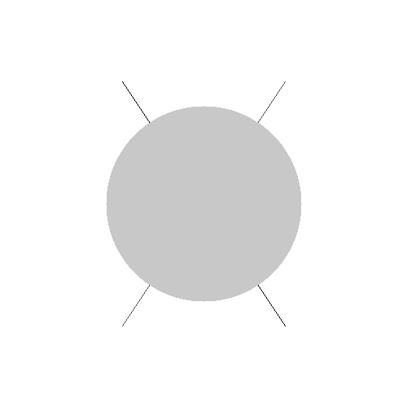

# 🎨 Rasterização e Computação Gráfica em Python

## 📌 Sobre o projeto
Este projeto implementa conceitos fundamentais de computação gráfica:

- Imagens vetoriais (SVG)
- Imagens matriciais (bitmap)
- Rasterização de formas geométricas
- Conversão de coordenadas

## 🚀 Tecnologias
- Python
- NumPy
- Pillow
- Pycairo

## 🧠 Conceitos aplicados
- Algoritmo de Bresenham (reta)
- Algoritmo de círculo
- Rasterização
- Sistemas de coordenadas

## 🖼 Resultados

### Vetorial (SVG)


### Círculo Matricial


### Rasterização Completa


## ▶️ Como executar

```bash
pip install -r requirements.txt
python src/main.py
